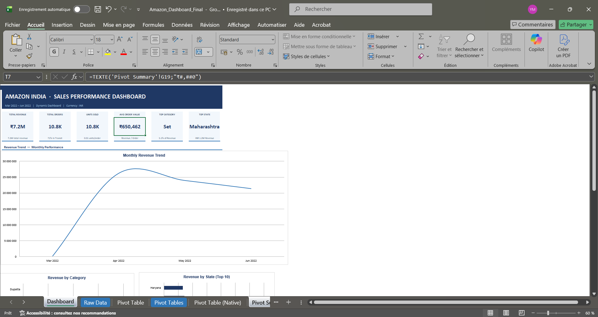

# Amazon Sales Dashboard (Excel Project)

## Project Overview
This project analyzes Amazon sales data using Microsoft Excel.  
The dashboard was created to visualize sales performance, revenue trends, and key business KPIs.

## Tools Used
- Microsoft Excel
- Pivot Tables
- Pivot Charts
- Dashboard Design
- Data Analysis

## Skills Demonstrated
- Data cleaning
- Data visualization
- KPI reporting
- Business analysis
- Dashboard creation

## Dashboard Preview

## Files
- `Amazon_Dashboard_Final.xlsx` → Full Excel dashboard project